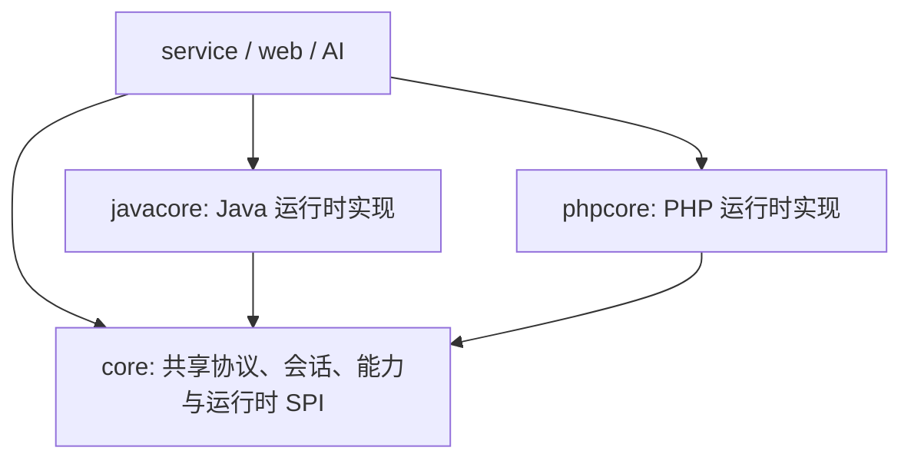

# Puppet 运行时模块架构

Java 和 PHP 是平等的 Puppet 运行时模块，不存在“Java core + PHP 适配器”的依赖关系。

## 模块边界

- `core`：只保留 `AbstractPuppetNode`、`PuppetRuntimeModule`、传输创建上下文、能力契约、RPC 契约、组件制品描述和通用会话状态。禁止依赖 `javacore` 或 `phpcore`。
- `javacore`：拥有 `JavaPuppetNode`、Java component 源码与 payload、Java 组件调用服务、代理/隧道引擎和 component 字节码审计。
- `phpcore`：与 `javacore` 使用同一 SPI，逐步实现 `PhpPuppetNode`、PHP component、脚本模板、插件与 PHP 伪装策略。
- `service`：通过 Spring 收集所有 `PuppetRuntimeModule`，按 `PuppetRuntime` 选择实现；它不内置 Java/PHP 分支创建逻辑。
- `web` 和 `ai`：只面向 `AbstractPuppetNode` 和 capability 接口编程，禁止强制转换为 `JavaPuppetNode` 或未来的 `PhpPuppetNode`。

## 平等性约束

1. 每个运行时只能注册一个 `PuppetRuntimeModule`，重复注册在启动阶段失败。
2. 新增上层功能必须先定义通用 capability，由运行时实现它；不在控制器中按语言分支。
3. 某运行时尚未实现的能力通过 `RuntimeProfile` / `CapabilityStatus` 声明为不可用，而不是假设 Java 能力必然存在。
4. component、plugin、脚本生成和伪装策略的实现归各自运行时模块；跨运行时的元数据契约归 `core`。

`phpcore` 当前只完成模块注册和边界骨架，`isReady()` 保持 `false`，直到 PHP 节点、握手和基础 component 完成，避免将半成品误标为可用。
