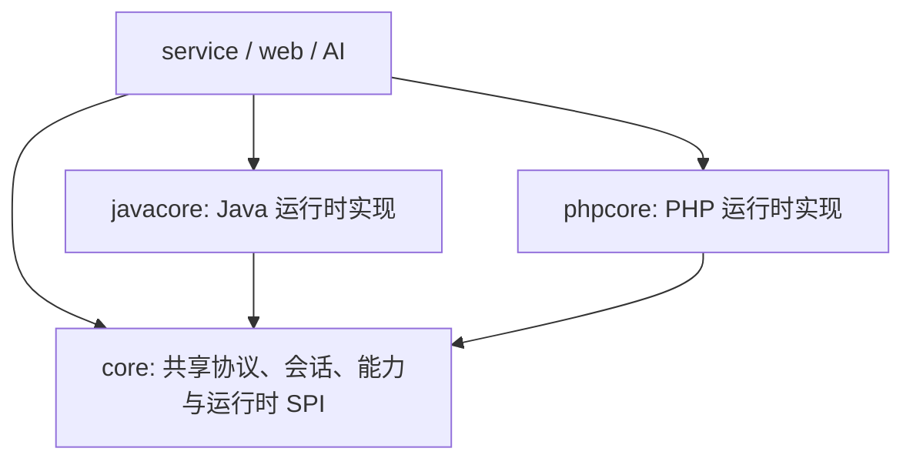

# Puppet 运行时模块架构

Java 和 PHP 是平等的 Puppet 运行时模块，不存在“Java core + PHP 适配器”的依赖关系。

## 模块边界

- `core`：只保留 `AbstractPuppetNode`、`PuppetRuntimeModule`、传输创建上下文、能力契约、RPC 契约、组件制品描述和通用会话状态。禁止依赖 `javacore` 或 `phpcore`。
- `javacore`：拥有 `JavaPuppetNode`、Java component 源码与 payload、Java 组件调用服务、代理/隧道引擎和 component 字节码审计。
- `phpcore`：与 `javacore` 使用同一 SPI，提供 `PhpPuppetNode`、PHP RPC、按需 component、脚本生成器、插件执行与 PHP 伪装校验。
- `service`：通过 Spring 收集所有 `PuppetRuntimeModule`，按 `PuppetRuntime` 选择实现；它不内置 Java/PHP 分支创建逻辑。
- `web` 和 `ai`：只面向 `AbstractPuppetNode` 和 capability 接口编程，禁止强制转换为 `JavaPuppetNode` 或未来的 `PhpPuppetNode`。

## 平等性约束

1. 每个运行时只能注册一个 `PuppetRuntimeModule`，重复注册在启动阶段失败。
2. 新增上层功能必须先定义通用 capability，由运行时实现它；控制器只在协议入口处完成运行时分派。
3. 某运行时尚未实现的能力通过 `RuntimeProfile` / `CapabilityStatus` 声明为不可用，而不是假设 Java 能力必然存在。
4. component、plugin、脚本生成和伪装策略的实现归各自运行时模块；跨运行时的元数据契约归 `core`。

## PHP 运行时状态

`phpcore` 已注册为可用运行时，`isReady()` 返回 `true`。当前交付范围：

- 通过通用 `PuppetNodeFactory` 创建 PHP 节点；测试连接只返回稳定 hostId 和缓存组件名，运行环境详情由 `BasicInfoComponent` 按需读取。
- 使用协议 v2 完成请求/响应伪装、HTTP RPC、URL/填充/Header Noise 策略及 hostId 传递。
- 提供基础信息、命令、文件、分块上传下载、压缩/解压、PHP 脚本、PDO 数据库和平台插件 capability。
- 通过 `/platform/shell-generator/generate/runtime` 生成 PHP 5.6+ 单文件 HTTP 启动器；外层只负责伪装编解码，内层使用与 Java Core 对齐的 `M=0/1/2/3` 测试、转发、加载和调用协议。组件按 digest 懒加载到目标临时目录，业务和运行环境检测逻辑均由组件承载。
- 平台脚本生成器、伪装管理、插件管理/调用、节点信息页和 AI 插件工具均按 runtime 识别 PHP。

当前 PHP endpoint 是请求式 HTTP 运行时，因此命令执行采用一次性结果模式；交互式终端的持续读写与进程控制仍属于 Java 节点能力。压缩/解压依赖目标环境的 `ZipArchive`，数据库能力依赖相应 PDO driver。
