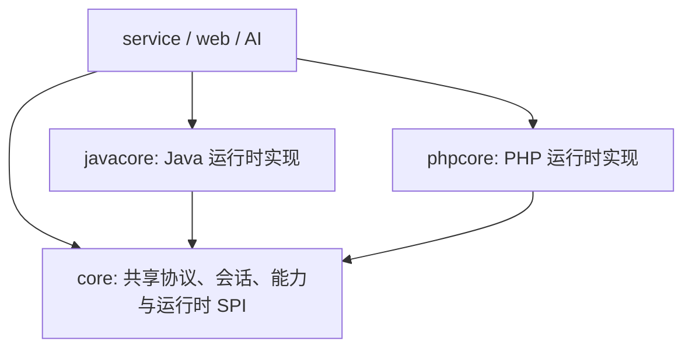

# Puppet 运行时模块架构

Java 和 PHP 是平等的 Puppet 运行时模块，不存在“Java core + PHP 适配器”的依赖关系。

## 模块边界

- `core`：保留 `AbstractPuppetNode`、`PuppetRuntimeModule`、传输创建上下文、能力契约、RPC 契约、组件制品描述、通用会话状态，以及仅依赖 `ComponentInvokeCapable` 的共享代理/隧道引擎。禁止依赖 `javacore` 或 `phpcore`。
- `javacore`：拥有 `JavaPuppetNode`、Java component 源码与 payload、Java 组件调用服务和 component 字节码审计。
- `phpcore`：与 `javacore` 使用同一 SPI，提供 `PhpPuppetNode`、PHP RPC、按需 component、脚本生成器、插件执行与 PHP 伪装校验。
- `service`：通过 Spring 收集所有 `PuppetRuntimeModule`，按 `PuppetRuntime` 选择实现；它不内置 Java/PHP 分支创建逻辑。
- `web` 和 `ai`：只面向 `AbstractPuppetNode` 和 capability 接口编程，禁止强制转换为 `JavaPuppetNode` 或未来的 `PhpPuppetNode`。

## 平等性约束

1. 每个运行时只能注册一个 `PuppetRuntimeModule`，重复注册在启动阶段失败。
2. 新增上层功能必须先定义通用 capability，由运行时实现它；控制器只在协议入口处完成运行时分派。
3. 某运行时尚未实现的能力通过 `RuntimeProfile` / `CapabilityStatus` 声明为不可用，而不是假设 Java 能力必然存在。
4. component、plugin、脚本生成和伪装策略的实现归各自运行时模块；跨运行时的元数据契约归 `core`。

## PHP 运行时状态

`phpcore` 已注册为可用运行时，`isReady()` 返回 `true`。当前交付范围：

- 通过通用 `PuppetNodeFactory` 创建 PHP 节点；测试连接只返回稳定 hostId 和缓存组件名，运行环境详情由 `BasicInfoComponent` 按需读取。
- 使用协议 v2 完成请求/响应伪装、HTTP RPC、URL/填充/Header Noise 策略及 hostId 传递。
- 提供基础信息、命令、文件、分块上传下载、压缩/解压、PHP 脚本、PDO 数据库、HTTP 发包、SOCKS5/HTTP 代理、本地转发、反向隧道、平台插件、进程管理、网络拓扑、实时网络连接、磁盘挂载、端口扫描/主机探活、服务管理、计划任务、注册表、事件日志、防火墙和用户账户 capability。
- 通过 `/platform/shell-generator/generate/runtime` 生成 PHP 5.6+ 单文件 HTTP 启动器；外层只负责伪装编解码，内层使用与 Java Core 对齐的 `M=0/1/2/3` 测试、转发、加载和调用协议。组件按 digest 懒加载到目标临时目录，业务和运行环境检测逻辑均由组件承载。
- 平台脚本生成器、伪装管理、插件管理/调用、节点信息页和 AI 插件工具均按 runtime 识别 PHP。

PHP endpoint 虽然采用请求式 HTTP 传输，但虚拟终端通过会话 ID 在目标临时目录维护进程与输出状态：Unix 优先使用 Python PTY，缺少 Python 时使用无额外依赖的命令后端；Windows 使用命令后端。只有真实 PTY 支持终端尺寸调整，命令后端仍保留工作目录、输入缓冲、清屏、中断和输出游标等稳定交互行为。网络代理组件同样使用目标临时目录中的队列和独立 PHP worker 保持跨请求 socket 状态，启动 worker 至少需要 `shell_exec`、`exec` 或 `popen` 之一。压缩/解压依赖目标环境的 `ZipArchive`。数据库管理层使用与运行时无关的连接描述，Java 适配器生成 JDBC 参数，PHP 适配器独立生成 PDO DSN；PHP 组件不解析或接收 JDBC URL。目标 PHP 需安装对应的 `pdo_mysql`、`pdo_pgsql`、`pdo_sqlsrv`/`pdo_dblib`、`pdo_oci` 或 `pdo_sqlite` driver。

PHP 启动器的组件缓存目录、文件名、扩展名和原子写入前缀均由生成 seed 派生；有状态 component 的状态目录与 worker token 则由部署路径派生。目标临时目录和后台进程参数不携带固定产品名，且同一 endpoint 内保持稳定，避免影响缓存命中与任务恢复。

目标完成首次握手并返回稳定 hostId 后，平台为每个 PHP component 派生 endpoint 专属组件别名和局部变量符号表，重新计算变体 digest 后再按需投递。目标缓存与 Ping 仅保存、返回不透明别名，`PhpPuppetNode` 在平台侧恢复为共享 capability ID；同一 endpoint 的变体保持稳定，不同 endpoint 的 component 源码和缓存 key 不同。

有状态 component 会把 config、status、queue、heartbeat 等逻辑文件角色映射为部署路径派生的不透明文件名。Scan 进度按开放端口、16 项批次或 250ms 时间窗落盘，Proxy worker 的状态写入限制为每 5 秒一次；Proxy 与 ReverseTunnel 会按运行状态和最后活动时间回收过期目录。

component 变体构建阶段会把 `msg` 与异常诊断文本拆分为 endpoint seed 派生的等价 PHP 表达式，目标返回语义保持不变，缓存源码中不再连续保存完整诊断句。`HttpRequestComponent` 的默认 User-Agent、Accept 与 Accept-Language 按目标操作系统选择一致画像，并在同一部署路径下保持稳定；显式请求头始终优先。

Linux 下的 Process 列表、端口到 PID 的归属、NetworkConnection socket 表和 Disk 挂载信息优先直接读取 `/proc`，结合 `disk_total_space`、`disk_free_space` 与 `posix_getpwuid` 完成解析；Unix 进程信号优先调用 `posix_kill`。Windows、macOS 以及受限 proc 挂载继续使用各自命令后端。

PHP 平台侧 HTTP 客户端以 endpoint 地址和 hostId 派生会话级传输画像：User-Agent、Accept、语言、同源 Referer、可选 Header 集合及生成 URL 在会话内保持稳定，调用方显式配置继续拥有最高优先级。携带请求体的方法只使用文本/API 类型的动态扩展名；启用 Padding 后优先补齐至有界的 1/2/4/8 KiB 长度桶并使用请求 seed 派生字段名。多次请求沿用原 RPC requestId，失败重试采用有上限的指数退避和确定性抖动。

PHP endpoint 的组件缓存按最近访问时间维护，最多保留 48 个制品，七天未访问的制品和五分钟未完成的原子写临时文件会被回收；平台侧 endpoint component 变体缓存采用 1024 项 LRU。终端状态通过临时文件加原子 rename 更新。Scan 最多保留 64 个任务，Proxy 最多保留 128 个连接目录，ReverseTunnel 最多保留 32 个 listener 和每 listener 256 个活动连接；代理和隧道队列单文件限制为 8 MiB。关闭的连接子树会按 TTL 回收，后台 worker 启动超时会写入停止标记。

Java `ComponentService` 同样以 endpoint 地址和 hostId 派生会话级传输画像，并复用稳定 URL、Header 集合、User-Agent、语言与同源 Referer。携带请求体的方法限制动态路径扩展名，显式 Header 继续优先。启用 Padding 后使用有界长度桶和请求派生字段名；重试沿用原 RPC requestId，并采用有上限的指数退避和确定性抖动。

## Puppet 侧运行代码清单

需要在目标 Puppet 环境执行的代码按运行时分为三类：

| 类别 | 位置 | 当前规模 | 加载方式 |
| --- | --- | ---: | --- |
| Java component | `javacore/src/main/java/org/leo/core/component` | 26 个单类组件 | 编译为同名 `.payload`，由 Java Core 按需加载 |
| PHP component | `phpcore/src/main/resources/components` | 25 个独立 PHP 文件 | 按内容 digest 写入目标临时目录并按需加载 |
| 启动与协议模板 | `jmg` 的 `LeoCore`/shell 模板、`phpcore/src/main/resources/templates` | 按运行时生成 | 生成单文件入口，负责握手、转发、组件加载与调用 |

Java component 必须保持 Java 6 字节码兼容，并且每个 payload 可以独立加载，因此不会为了减少少量重复而引入跨 payload 的公共运行时依赖。Java Core 与 Component 的运行时类名按 hostId、endpoint 和 component 标识派生：同一节点使用一致的应用包族，重试及重启保持类名和成员变体稳定，不再混合 JDK 保留命名空间与 lambda 后缀。转换过程保留 major version 50，并在移除调试元数据和注解后通过 ASM 重建常量池。PHP component 同样是独立制品；`$get` 等极小的局部读取函数保留在文件内，避免组件依赖启动器版本或预加载顺序。目标侧的超时、输出上限、临时文件清理和状态过期属于稳定性边界，不作为冗余降级删除。

Java 平台侧已加载 Component 状态采用 host LRU、单 host 数量上限和空闲 TTL，节点关闭时统一清理所有 service 缓存。需要工作池的单类 Component 直接实现 `ThreadFactory`，以运行时类名画像生成线程名，避免默认 `pool-N-thread-M` 以及固定功能名称；该方式不会产生额外内部类。请求失败在常规日志级别只记录操作、尝试次数、异常类型和摘要，堆栈保留在 debug 级别。Component 编译脚本逐源码、限堆编译，并在 Java 8 javac 不可用时使用 ECJ，最终仍执行 major version、单 class 和 Java 6 API 审计。

同一 `JavaPuppetNode` 创建的全部 `ComponentService` 共享节点级加载注册表。相同 host/component 的并发加载通过 single-flight 合并为一次 class 定义请求，随后各 service 直接复用共享状态，避免同名类在同一 ClassLoader 中重复定义。连续加载失败达到阈值后进入有界冷却期，降低重复传输大体积制品的固定节奏；关闭节点时递增注册表 generation，较早的在途加载结束后不会重新写回已清理缓存。

完整制品分组如下：

- Java/PHP 共有的基础能力：`BasicInfo`、`Compress`、`Database`、`Decompress`、`ExecCommand`、`ExecCommandSimple`、`ExecScript`、`File`、`FileDownload`、`FileUpload`、`HttpRequest`、`Plugin`、`ProxyForward`、`ReverseTunnel`；PHP 另外以独立 component 交付 `Process`、`NetworkInfo`、`Disk`、`NetworkConnection`、`Scan`、`Service`、`ScheduledTask`、`Registry`、`EventLog`、`Firewall`、`UserAccount`，Java 则通过运行时服务或专用 payload 实现同名 capability。
- Java 专有的 12 项能力：`Clipboard`、`CredentialHarvest`、`FileEnhance`、`Fingerprint`、`HostIsReachable`、`PortScan`、`ReconScan`、`Resource`、`Screen`、`SpringFrameworkManage`、`TomcatCatalinaManage`、`WeblogicCatalinaManage`。
- Java 启动制品：`LeoCore` 动态生成 Core 字节码，配合 7 个 HTTP shell 模板和 9 个格式化/加载模板。旧的静态 `core-template/core.class` 和只被测试引用的 `XXL-Job-DefineClass.java.txt` 已删除。各模板按目标容器、入口格式和 JDK 边界分别生成，不在 Puppet 启动后形成连续降级链。
- PHP 启动制品：`php-core.php.txt` 与 `php-puppet.php.txt`，分别承载 RPC 内核和单文件 HTTP 入口。

## 兼容性与降级策略

目标侧实现统一遵循以下约束：

1. 同一操作系统上的一项能力只保留一个主实现和至多一个功能性降级实现。
2. Linux、macOS、Windows 的系统接口差异属于平台实现，不叠加为同平台的多层候选链。
3. 不依次探测多个可选外部程序；主实现不可用时直接进入无额外依赖的基础实现。
4. 降级实现不伪装完整能力，通过 `pty`、`resizable`、`backend` 等元数据明确能力边界。
5. 为兼容旧运行环境保留必要的语法、反射和系统分支，但删除不可达分支、未使用变量及只增加路径数量而不改善契约的候选实现。

当前关键能力矩阵：

| 能力 | Java | PHP |
| --- | --- | --- |
| Unix 虚拟终端 | Python PTY；直接 shell pipe 降级 | Python PTY；命令后端降级 |
| Windows 虚拟终端 | `cmd.exe` pipe | 命令后端 |
| 终端 resize | 仅 Python PTY | 仅 Python PTY |
| 一次性命令 | `ProcessBuilder` | `proc_open`；`exec` 降级 |
| HTTP 发包 | `HttpURLConnection` | cURL；PHP stream 降级 |
| 数据库管理 | 统一连接描述 → Java 适配器 → JDBC | 统一连接描述 → PHP 适配器 → PDO |
| SOCKS5 / HTTP / 本地转发 | 共享平台代理引擎 + Java socket component | 共享平台代理引擎 + PHP 后台 worker component |
| 反向隧道 | 共享平台隧道引擎 + Java listener component | 共享平台隧道引擎 + PHP 后台 listener worker |
| 基础信息 | JVM/系统接口与必要的 OS 分支 | `/proc`、`sysctl`、Windows 系统命令与 PHP 原生接口 |

虚拟终端已移除 `socat`、不同 `script` 方言等多层可选程序探测。这样保留一个完整 PTY 路径和一个可预测的基础路径，同时避免目标环境因外部程序版本差异进入大量难以验证的分支。
